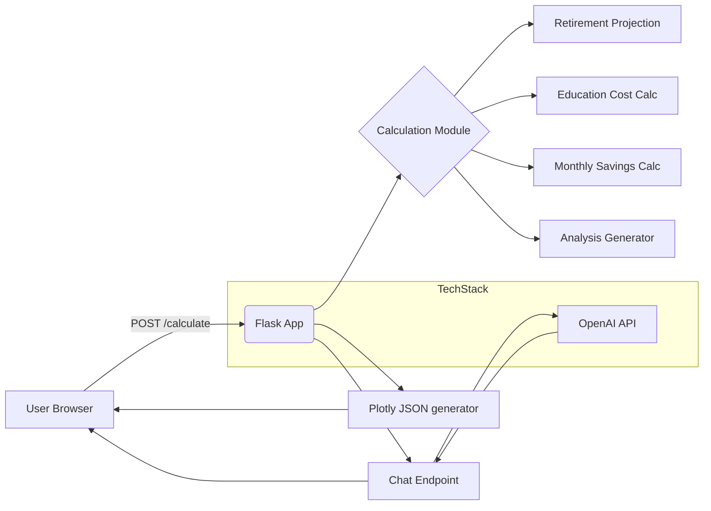

# Agentic AI Demo — Financial Planner

Welcome — this repository contains a demo web application that helps visualize retirement and education savings scenarios and includes an integrated assistant for follow-up questions.

Audience
--------
This project is intended for two groups:

- End users: try the app in your browser, explore visualizations, and ask follow-up questions with the built-in assistant.
- Developers: clone the repo, run locally, extend the financial models, or regenerate the project using the included single-shot prompt.

What the app provides
---------------------

- Interactive inputs for: current age, current savings, annual income, target retirement age, and dynamic child entries.
- Plotly visualizations: retirement projection, education cost comparison, monthly savings requirement, and a savings distribution sunburst.
- Plain-English financial health summary (risk level, key figures, and recommended actions).
- An OpenAI-backed chat assistant that answers follow-ups using the calculated context.

Quick start (overview)
----------------------

1. See `financial_planner/README.md` for detailed setup and troubleshooting instructions.
2. Use the helper script `financial_planner/run_local.ps1` on Windows to create a virtual environment, install dependencies, create a `.env` placeholder, and start the server.
3. Open `http://localhost:5000`, click "Start Planning", enter your information, and press Calculate.

Note: this is a demo — not financial advice.

Repository layout (important files)
---------------------------------

- `financial_planner/app.py` — Flask server and endpoints (`/`, `/input`, `/calculate`, `/chat`).
- `financial_planner/templates/` — Jinja2 templates (UI pages).
- `financial_planner/static/` — Static assets (client JS for chat, etc.).
- `financial_planner/requirements.txt` — Python dependencies.
- `financial_planner/PROMPT_generate_financial_planner.md` — A single-shot LLM prompt to recreate the project.
- `financial_planner/run_local.ps1` — Convenience script for Windows PowerShell.

Developer notes
---------------

- Add your OpenAI API key to `financial_planner/.env` as:

```
OPENAI_API_KEY=sk-...  # keep this secret
```

- The prompt in `PROMPT_generate_financial_planner.md` contains a single instruction to regenerate the entire project; it's useful when bootstrapping or for automated code generation.

Contributing and extending
--------------------------

The demo is intentionally compact and easy to customize. Suggested improvements:

- Replace or improve the financial model assumptions (returns, inflation, savings rate).
- Add persistence (SQLite) to store scenarios and user sessions.
- Add authentication and per-user scenario management.
- Add unit tests and CI for the calculation code and endpoints.

Security and publishing
-----------------------

- Never commit `.env` or API keys to version control. Use `.gitignore` to exclude `.env` and virtual environments.
- If deploying publicly, use secure secrets management and review data retention and privacy requirements.

License and disclaimer
----------------------

This repository is provided as-is for demonstration and learning. It is not professional financial advice.

## Architecture diagrams

### Technical flow (high-level)



%% Styling for Mermaid (some viewers support these directives)


Notes: the app is a lightweight orchestration layer (Flask) that runs local calculation logic and returns Plotly JSON to the browser; the chat endpoint forwards context to OpenAI. The prompt in `financial_planner/PROMPT_generate_financial_planner.md` documents how to (re)generate the whole project.

### Business flow (very high level)


This business flow shows the user experience: input -> calculate -> interpret -> interact -> adjust.

